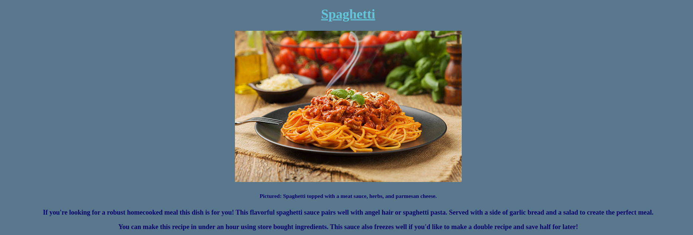
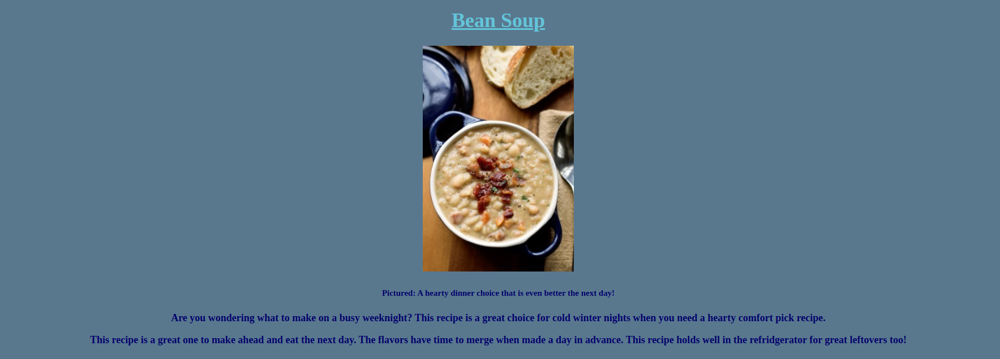
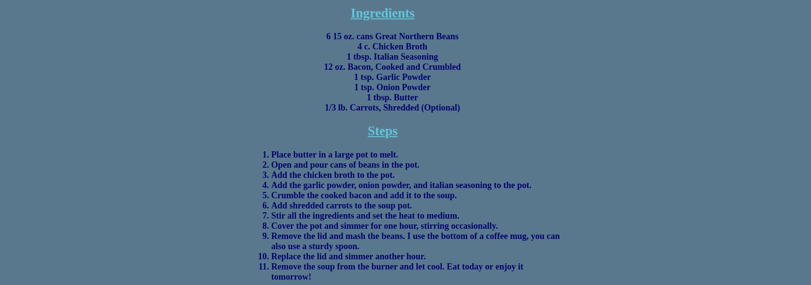
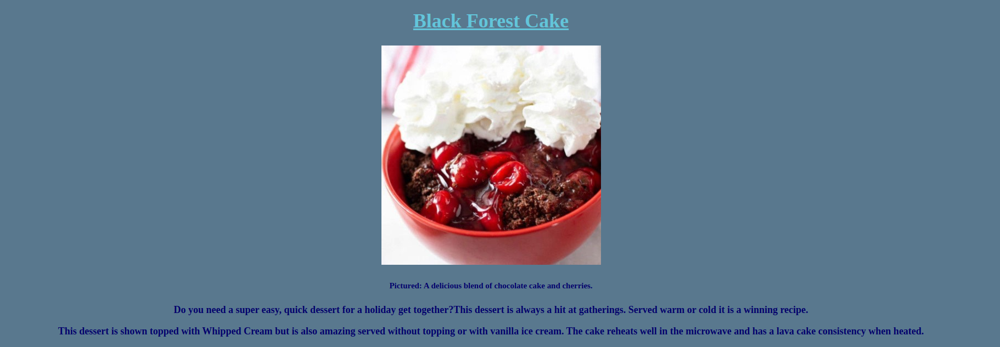

# odin-recipes

Objective:

Recipes Website:

I created a basic recipe website from The Odin Project curriculum. The website uses html skills that I am learning and introduces some css elements. This is my first attempt at building a webpage. This webpage was built using directions from The Odin Project and also by utilizing resources I found while completing internet searches. The links to the recipes work and take you to a new page for each recipe.

Finished Webpage Images:

Front Page of Website:

Recipe 1:

Recipe 2:

Recipe 3:

